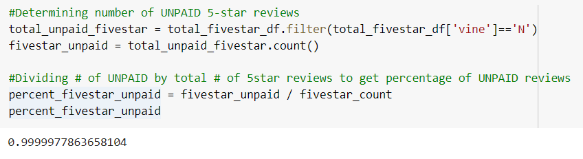

# Amazon_Vine_Analysis
In this challenge were asked to review the 'Digital E-Book Purchases', those that left reviews and how many of those were favorable. Amazon has a Vine Program that partners with publishers and manufacturers to send products to participants, in return they must write a review of the product. What we are trying to figure out is, how generous with their stars are these paid participants. I'll be reviewing the E-Book database and looking at how many people left 5-star ratings, how many of those were paid Vine participants and how many were fans or unpaid reviewers. 

##Reults: To Pay or not to Pay
Once we downloaded the information, we cleaned it up a little and took the information we needed; like reviewers ID, the star rating they gave the title, were they vine participants, how helpful were their reviews and total votes. Total reviews were well over 12.5 million reviews and of those reviews 7,679,679 received 5-star reviews. Of the over 7.6 million 5-star reviews only 17 were paid reviewers, that equals less than 1% of the 5-star reviwers leaving the rest to unpaid reviewers.  

From the information reviewed, we could also see how much influence these reviewers held, as how many people browsing had used the review to make a decision about the product. From the over 12.5 million reviews 70,726 had votes that were equal to or higher than 20 votes. Of those, 54,092 had a healthy ration of over 50% when their helpful votes were divided by the total votes they had received. 

We can't speak for the other products that are being reviewed but for the e-book and those that write reviews, they don't need to be paid to receive favorable reviews. Great information for writers and publishers since this way they won't expense more product out to convince audiences about their product. Most artist or writers will cary their genre and fans with them regardless if it's an actual book or digital. Books are easier and less expensive to acquire and most people that read books are into writing too, so they will not hesitate to write a review. Somthing like this might be different with appliances, electronics, or other high ticket items or items needed on a daily bases. 
